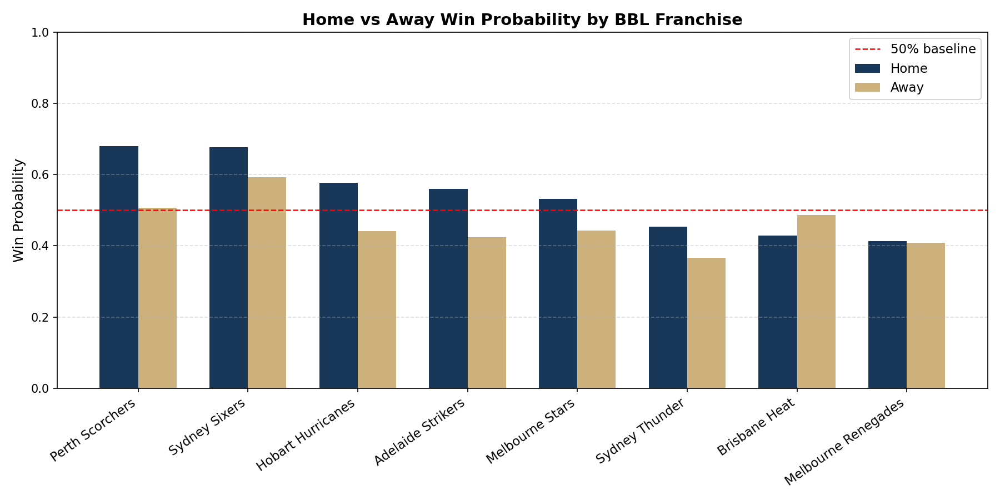

# BBL Home Advantage — Data Science Project B



Analysis of home-ground advantage in the Big Bash League (BBL) across 14 seasons (2011/12 to 2024/25). This repository contains all code, data exports, and the final report for **Data Science Project B** at Adelaide University.

**Student:** Usama Asif (a1917716)
**Supervisor:** Mikaela Fudolig
**School of Mathematical Sciences, Adelaide University**

---

## Research Questions

1. How large is the raw home advantage in the BBL across the 14 seasons in the dataset?
2. Does home advantage persist after controlling for recent form, head-to-head history, toss outcome, and venue familiarity?
3. Do player- and venue-level familiarity metrics explain the home advantage signal?
4. Is the advantage robust across venue types, COVID-era disruptions, and match phases (first-six-over performance, first-innings scoring, DRS umpiring)?

---

## Key Findings

- Home teams win **54.1%** of matches (M1 baseline; OR = 1.36, p = 0.008).
- The advantage **survives all five models** after controlling for form, head-to-head history, toss, and familiarity (M2: OR = 1.39, p = 0.005; M5: OR = 1.40, p = 0.004).
- **Recent form** (OR = 1.65) and **head-to-head win rate** (OR = 3.58) are the only other significant predictors.
- Venue familiarity metrics carry no independent signal once built from historical data only — their earlier significance in Project A was data leakage.
- First-innings score is the strongest in-match predictor (AUC = 0.769); break-even is **162 runs**.
- No umpiring bias detected via DRS reviews (χ² = 0.059, p = 0.807), though the test is underpowered at 3 seasons.

---

## Models

| Model | Description | AUC | AIC |
|-------|-------------|-----|-----|
| M1 | Baseline logistic regression (`is_home` only) | 0.613 | 1453.83 |
| M2 | Full logistic regression (10 predictors) | 0.676 | 1460.98 |
| M3 | LASSO interaction model (45 interactions → 7 survive) | 0.663 | 1470.65 |
| M4 | Bayesian GLMM via `statsmodels BinomialBayesMixedGLM` | ≈0.676 | — |
| M5 | `lme4 glmer` mixed-effects (gold-standard specification) | ≈0.676 | 1671.9† |

†M5 AIC includes random effect parameters and is not comparable to M1–M3.

Train/test split: pre-2023/24 seasons for training (1,048 rows), 2023/24 onward for testing (160 rows). All lag-based features are computed from historical data only — no data leakage.

---

## Repository Structure

```
.
├── Home_win_model (1).ipynb       # Main modelling notebook (M1–M5, feature engineering)
├── BBL_Extended_Analysis.ipynb    # Extended analysis (toss, innings phase, DRS, robustness)
├── BBL_Data_Quality_Check.ipynb   # Data cleaning and quality checks
├── report_project_b.tex           # Final report (LaTeX source)
└── *.png                          # Figures generated by the notebooks
```

> **Note:** Raw Cricsheet JSON data is not included. Download it from [cricsheet.org](https://cricsheet.org) and place it in `bbl_json/` before running the notebooks.

---

## Data

Raw BBL match data sourced from [Cricsheet](https://cricsheet.org/) (JSON ball-by-ball format). The cleaning pipeline exports intermediate CSVs at every transformation step for full reproducibility.

Key engineered features:
- `recent_form_5` — wins in last 5 matches (lag-based, no leakage)
- `h2h_win_rate` — Bayesian-shrunk head-to-head win rate (k = 5 prior)
- `pp_rr_lag5` — first-six-over run rate, 5-match rolling average
- Venue familiarity metrics — batting average, strike rate, bowling economy at each ground (historical only)

---

## Requirements

```
python >= 3.9
pandas
numpy
scikit-learn
statsmodels
scipy
matplotlib
seaborn
rpy2          # for M5 lme4 glmer
```

Install R with `lme4` for M5:
```r
install.packages("lme4")
```

---

## How to Run

1. Place raw Cricsheet JSON files in `bbl_json/`.
2. Run `BBL_Data_Quality_Check.ipynb` to clean the data.
3. Run `Home_win_model (1).ipynb` to reproduce M1–M5 and all figures.
4. Run `BBL_Extended_Analysis.ipynb` for toss, innings-phase, DRS, and robustness analyses.

---

## Report

The final report (`report_project_b.tex`) compiles in any standard LaTeX distribution or on [Overleaf](https://www.overleaf.com). Upload `DS_Project_B.zip` to a blank Overleaf project, then set `report_project_b.tex` as the main document.

---

## License

This project was submitted for academic assessment. Code is available for reference. Do not submit any part of this work as your own.
